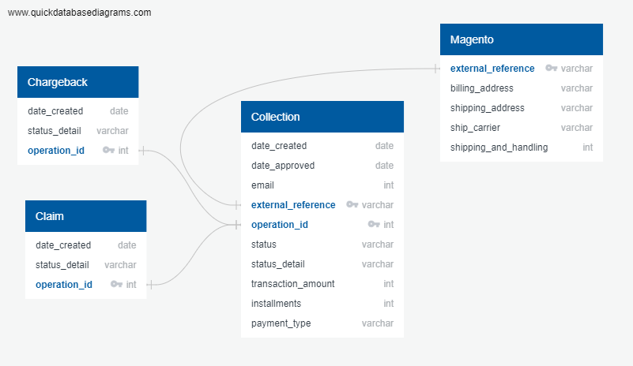

# Fraud risk prediction.
## Selected topic
We will analyze a large dataset of purchases that have resulted as a "chargeback" or "claim", with the objective to predict and visualize the patterns the clients have to get a rejected transaction, using a machine learning model.

## Reason they selected the topic

Nowadays, the company Telmov have found an increase tendency of chargebacks and claims, so to try to reduce the quantity of losses, it's necessary to get more insights of what kind of purchase could be and to make a decision in case of a fraudulent purchase. So, we want to predict if a buyer will do a fraudulent purchase. The data set we were able to get was of one year purchases, in a range from may-21 to may-22.

## Description of the source of data

- **date_created:** The date and hour when the chargeback and claim were created.  
- **date_approved:** The date and hour when the purchase was approved.
- **customer_ID:** Consecutive numbers that correspond to a client's ID.
- **external_reference:** Reference number of the purchases through Mercado Libre.
- **operation_id:** Transaction reference number into Telmov.
- **status:** Purchase status (approved, rejected, etc.)
- **status_detail:** Operation status (claim, chargeback, etc.)
- **transaction_amount:** Purchase total.
- **installments:** How many periods it will pay the transaction_amount.
- **payment_type:** Purchase payment method
- **billing_address:** Billing address (only zipcode needed).
- **shipping_address:** Delivery address (only zipcode needed).
- **ship_carrier:** Delivery carrier.
- **shipping_and_handling:** Delivery fee.
- **postal_code:** postal code.
- **state:** postal code state.
- **municipality:** postal code municipality.
- **longitude:** postal code longitude.
- **latitude:** postal code latitude.

In the following figure we show the relation of the dataset:

## Questions we hope to answer with the data

- Is it a safe operation?
- What variables are related to the fraudulent buyer?
- What are the big patterns the purchase shows?
- What range of charges is most likely to be fraudulent?
- What is the fraudulent buyer likely to buy?
- Are fraud operations made from a specific region?

## Data exploration
We get a year of information about purchases of cellphones, together with how many of those purchases has result as a fraud. The information was divided in three core databases:
- Collection: which is the general information of the purchases (date, client ID, amount, purchase order, etc.)
- Claim/Fraud: this database give us the information of purchases that result as a fraud/chargeback or have a claim by the customer.
- Magento: the magento database gave us information regarding the products that where pruchased in each pruchase order

We needed to cast most of the information due to many columns were declared as a string when the databases had other types like integers, datetime, floats, etc. Some information needed was inside of a very long string with not relevant information, so we need to use regular expression to get the information we needed such as: zipcode from the address, sku from the product, carrier, etc. Also some columns need to be splited for easy extraction of information.

We define new columns with the information we needed of each dataset, and at the end we merge the three different data sets in just one table called "Whole_Collection", we will use this database to create the machine learning module.

We needed to merge the "Whole_Collection" table with a table of postal codes that we obtained via SEPOMEX; the name of this second table as "CPs_Geometry".
Once we get both tables, these two were uploaded to AWS to have them availables.

The merge will be used for the visualization: this will give us visibility regarding where the purchases were made and found a tendency to corroborate with the machine learning model. The merge have been performed via colab and with the help of pyspark.sql funcitons

The last table obtained by this merge will be called "whole_collection_geom" and this will be storage in a AWS database and in a bucket to be available for the visibility, as well as in postgres for any analysis needed.

## Machine Learning Model Second Segment

### Description of preliminary data preprocessing

After running a Resampling model in the first segment we realized that we had to go one step back. For this part we ran the model again but considering less information. So as part of a data preprocessing we selected specific columns in order to have less noise in the model. 

(Remember that the first accuracy score was 0.5 which was the same as a simple guess.)

Considering only the following columns:customer_ID, status, transaction_amount, installments, payment_type, month_created, shp_zipcode, fraud_flag and Item_1 we got an improvement on the balanced_accuracy_score of 0.77

### Description of preliminary feature engineering and preliminary feature selection, including the decision-making process

After the improvement obtained in the last point. We looked for different models that could better answer the questions we are looking for. For this case we decided to go with decision tree and random forest. 

The main reason behind this decision is that the model is best suited as it's name refers to make decisions and determining in this case if a transaction is fraud or not.

In order to use decision tree model and random forest we took even less data into consideration.

### Description of how data was split into training and testing sets

Data was splitted considering 75% for training and 25% for testing also taking into account the fact of having stratified splitting due to the number of fraud transactions which is very low compared to the size of the whole database.

After running the model these are the results:

As you may see there was a lot of improvement as for the accuracy score and for the recall.

### Explanation of model choice, including limitations and benefits

Finally we decided to try Random Forest, after all it is an improvement on how decision tree model  works.

The main reasons for this decision are:

#### Random forest algorithms:

* Are robust against overfitting as all of those weak learners are trained on different pieces of the data.
* Can be used to rank the importance of input variables in a natural way.
* Can handle thousands of input variables without variable deletion.
* Are robust to outliers and nonlinear data.
* Run efficiently on large datasets.

### Interpretation of results:

We need to improve the recall score, 0.30 tells us that 30% of the times we'll be right when detecting actual frauds, but 70% of the time we won't. One benefit of the current model is that we are not losing many transactions by classifying them as fraud when they are not, which is good for the business but there's still room for improvement so we can catch all of the fraud transactions. 

We ran the model with 500 n_estimators which are the number of trees that were created by the algorithm. Generally, the higher number makes the predictions stronger and more stable, but can slow down the output because of the higher training time allocated. So for this test we decided to go with 500 and didn't take much time.

Now we can clearly see which features, or columns are more relevant.

